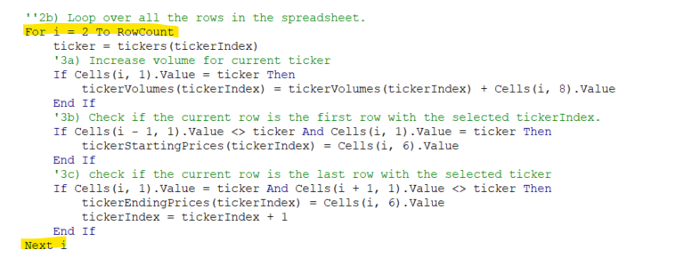

# stock-analysis

## Overview of Project

### Purpose

We started this project to help our friend Steve, who just graduated with his Finance degree.
His parents have decided to become his first clients.
They are passionate about Green Energy.
They invested all their money in DAQ0 New Energy Corp (ticker symbol DQ).
Steve wants them to diversify, and has created a spreadsheet of data for all Green Energy stocks.
We used Excel and VBA to help him analyze the data.

### Analysis and Challenges

Two analyses were performed for Steve.
The original version correctly showed that DQ earned a +199.4% return for 2017, but a -62.6% loss for 2018.
It also showed that two stocks (ENPH and RUN) had positive returns for both years.
The second version refactored the code for better performance.

### Analysis of our First Implementation

Our first implementation used a subroutine called AllStocksAnalysis(). As can be seen below, it ran in approximately 0.86 seconds on all 3013 rows of data in both the 2017 and 2018 sheets.

### Analysis of our Refactored Implementation

Our second, refactored implementation used a subroutine called AllStocksAnalysisRefactored(). As can be seen below, it ran in approximately 0.18 seconds for the 2017 sheet and 0.17 seconds for the 2018 sheet.

## Results

Our refactoring resulted in an approximately 5x speedup.

The main reason for this is that the original implementation (AllStocksAnalysis) looped through all rows of data (n=3013) for each stock ticker symbol (n=12).

These nested loops can be seen in the image below.

The refactored implementation (AllStocksAnalysisRefactored) only looped once through the rows of data (n=3013).

This single loop can be seen in the image below:

## Summary

1) What are the advantages or disadvantages of refactoring code?

In general, according to Donald Knuth, "Premature optimization is the root of all evil". It can lead to code which is harder to understand and can hide bugs if not done properly.

Unless there is a clear performance problem, trying to refactor for performance is usually a mistake. However, refactoring to improve readability, stability, or code reuse is nearly always reasonable.

In our case, performance was the major observed effect of refactoring, and understandability was not greatly impacted.

2) How do these pros and cons apply to refactoring the original VBA script?

The computational complexity of the original implementation is O(n*m) where n is the number of tickers, and m is the number of rows of data. In this case, n is much smaller than m, so this reduces to O(m), where we should expect roughly linear performance which is mostly dependent on the rows of data in the 2017 or 2018 sheets.

That is what we observed. However, we would have expected the original version to be 12x slower than the refactored version since there are 12 tickers. In reality it was only 5x slower. If we had more data to work with, and if we had averaged the results over more runs, the performance difference is expected to approach 12x.

However, as the number of tickers approaches the number of rows, the original implementation approaches O(m^2), so performance will be greatly impacted by the number of ticker symbols. In this case, we would have seen a much more dramatic speedup with our refactored version. We did not have data which would allow this analysis, since all we had were the 12 tickers.
